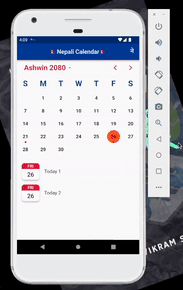
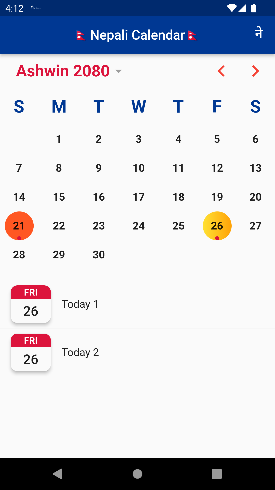
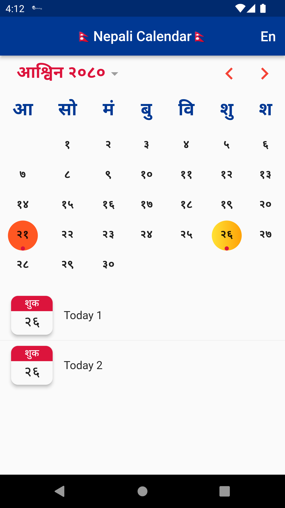

# Nepali Calendar 
# English Calendar [Upcoming]

Nepali Calendar with the custom styles and colors. Extension of [nepali_date_picker](https://pub.dev/packages/nepali_date_picker)

### Upcoming Features
Nepali to English Calendar Conversion  



### Salient Features
* Nepali Calendar
* Events
* Nepali Calendar in both English and Devanagiri Text
* Supports from 1970 B.S. to 2100 B.S.
* English Calendar Conversion [Upcoming]

 

## Installation

Add package to pubspec.yaml.

```dart
nepali_english_calendar: ^1.0.0
```
## Usages

Import the package.

```dart
import 'package:nepali_english_calendar/nepali_english_calendar.dart'
```
Add NepaliCalendar to the widget tree

```dart
    NepaliCalendar(
        monthYearPickerStyle:
            TextStyle(color: Colors.red, fontWeight: FontWeight.bold, fontSize: 24),
        //Color to left right button
        rightLeftButtonColor: Colors.red,
        //Styles to Week Row
        weekHeaderStyle:
            TextStyle(color: Colors.blue, fontWeight: FontWeight.bold, fontSize: 26),
        initialDate: NepaliDateTime.now(),
        firstDate: NepaliDateTime(2070),
        lastDate: NepaliDateTime(2090),
        onDateChanged: (date) => _selectedDate.value = date,
        dayBuilder: (dayToBuild) {
        return Stack(
            children: <Widget>[
            Center(
                child: Text(
                NepaliUtils().language == Language.english
                    ? '${dayToBuild.day}'
                    : NepaliUnicode.convert('${dayToBuild.day}'),
                style: Theme.of(context)
                    .textTheme
                    .bodyMedium!
                    .copyWith(fontWeight: FontWeight.bold),
                ),
            ),
            if (events.any((event) => _dayEquals(event.date, dayToBuild)))
                Align(
                alignment: Alignment.bottomCenter,
                child: Container(
                    width: 6,
                    height: 6,
                    decoration:
                        BoxDecoration(shape: BoxShape.circle, color: Colors.red),
                ),
                )
            ],
        );
        },
        selectedDayDecoration: BoxDecoration(
        color: Colors.deepOrange,
        shape: BoxShape.circle,
        ),
        todayDecoration: BoxDecoration(
        gradient: LinearGradient(colors: [Colors.yellow, Colors.orange]),
        shape: BoxShape.circle,
        ),
    ),
```

## License

```
MIT License

Copyright (c) [2023] [Lakshydeep Vikram Sah]

Permission is hereby granted, free of charge, to any person obtaining a copy
of this software and associated documentation files (the "Software"), to deal
in the Software without restriction, including without limitation the rights
to use, copy, modify, merge, publish, distribute, sublicense, and/or sell
copies of the Software, and to permit persons to whom the Software is
furnished to do so, subject to the following conditions:

The above copyright notice and this permission notice shall be included in all
copies or substantial portions of the Software.

THE SOFTWARE IS PROVIDED "AS IS", WITHOUT WARRANTY OF ANY KIND, EXPRESS OR
IMPLIED, INCLUDING BUT NOT LIMITED TO THE WARRANTIES OF MERCHANTABILITY,
FITNESS FOR A PARTICULAR PURPOSE AND NONINFRINGEMENT. IN NO EVENT SHALL THE
AUTHORS OR COPYRIGHT HOLDERS BE LIABLE FOR ANY CLAIM, DAMAGES OR OTHER
LIABILITY, WHETHER IN AN ACTION OF CONTRACT, TORT OR OTHERWISE, ARISING FROM,
OUT OF OR IN CONNECTION WITH THE SOFTWARE OR THE USE OR OTHER DEALINGS IN THE
SOFTWARE.
```

## Support and feedback

If I miss to add some feature, feel free to open a ticket or contribute!
You can reach me here:
[LinkedIn](https://www.linkedin.com/in/lakshydeep-14/) | 
[GitHub](https://github.com/lakshydeep-14) | 
[Medium](https://lakshydeep-14.medium.com/) | 
[Google DevLibrary](https://devlibrary.withgoogle.com/authors/lakshydeep-14)